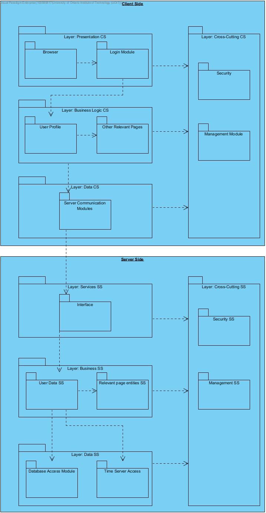
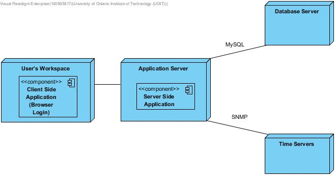

# 2.1 ADD Step 1: Review Inputs  
The first step of the ADD method involves reviewing the inputs and identifying which requirements will be considered as drivers. The inputs are listed in the below table with details.

| Category        | Details           |
| ------------- |:-------------|
| Design Purpose      | The purpose is to produce an efficient and sufficiently detailed design to support the construction of the Course Management System. |
| Primary Functional Requirements     | The primary use cases were determined to be:   UC-1: Because it directly supports the primary requirements of the system   UC-4: Because it directly supports the primary requirements of the system   UC-6: Because it directly supports the primary requirements of the system   UC-13: Because it directly supports the primary requirements of the system   UC-16: Because of the technical issues associated   UC-20: Because of the technical issues associated   UC-21 Because of technical issues associated   |

### Quality Attribute Scenarios:  
The scenarios were described in Section 1.2. They have now been prioritized as follows:

| Scenario ID        | Importance to the Customer           | Difficulty of Implementation According to the Architect  |
| ------------- |:-------------:| :-----:|
| QA-1      | High | High |
| QA-2      | High      |   Low |
| QA-3 | High      |    Medium |
| QA-4 | Medium    | Medium |
| QA-5 | High | High|

### Constraints: 
All of the constraints discussed in Section 1.3 are included as drivers.

### Architectural concerns: 
All of the architectural concerns discussed in Section 1.4 are included as drivers.

# 2.2 Iteration 1  
This section presents the results of the activities that are performed in each of the steps of ADD in the first iteration of the design process.

**2.2.1 Selecting Drivers**  
This is the first iteration of the ADD process on the CMS system. The iteration goal is to establish an overall system structure. The following influence that structure:

QA-1: Performance  
QA-2: Modifiability  
QA-3: Availability  
CON-2: Must be user friendly. Support Dutch and English. Max 3 clicks to reach any content. Single login to access all content. Consistent UI 
CON-3: All content must be accessible by disabled users  
CON-5: Must work and synchronize with secondary universities  

  
**FIGURE 2.1** Context Diagram for the CMS System

**2.2.2 Elements of the System to Refine**  
This is a greenfield development effort (Cervantes, 2016). So the element to refine is the CMS system as a whole. See Figure 2.1 for details on this system. Using the textbook, refinement is done through decomposition.

**2.2.3 Design Concepts that Satisfy the Selected Drivers**  
Design concepts are selected according to Appendix A in FCAPS. In order to establish an overall structure the following design decisions were made: 

| Design Decisions and Location | Rationale |
| :---------- | :---------- |
| Logically Structure the client and server part of the system using the Web based application architecture. | The rationale behind selecting this is we do not want to deploy the application on every students machine (CON-2), and students should be able to access this system where ever they want (QA-3 and QA-2). It needs to be accessible over the internet and we want to minimize client-side resources. <table><tr> <th>Alternative</th> <th>Reason for Discarding</th> </tr> <tr> <td>Rich Client Application</td> <td>Has to be deployed on users machine and we want portability</td> </tr> <td>Rich Internet Application</td> <td>Restricted Access to local resources and out performed when compared to Web based </td> <tr> </tr> <tr> <td>Mobile application</td> <td> The limitations that make this option not viable is the screen size, and resources available. </td> </tr> <tr> <td>Service Applications</td> <td>Application is used by humans so needs user interface.</td> </tr></table> |
| Physically structure the application using the Four-Tier Deployment | This deployment has the best security as due to accessibility needs, it allows the web server to reside in a publicly accessible network. <table><tr> <th>Alternative</th> <th>Reason for Discarding</th> </tr> <tr> <td>>4 Tier Deployment</td> <td>Not necessary for our application. Will increase complexity for little increased performance results</td> </tr> <td>< 3 Tier Deployment</td> <td>Not complex enough, need at least three tiers for the web based application as complex as ours. </td> <tr> </tr> <tr> <td>Distributed Deployment</td> <td>  The downside is that making modifications like adding tiers is expensive </td> </tr></table> |
| Code the User Interface using HTML, PHP, and Javascript | HTML and PHP is easy to code and Javascript allows easy access to server. HTML and Javascript is also very easy to code and make changes. |
| Creating relational database using MySQL | MySQL is easy to work with HTML and PHP to make connections directly to the database. |

**2.2.4 Instantiate Architectural Elements, Allocate Responsibilities, and Define Interfaces**  
The instantiation design decisions made in this iteration are summarized in the following table:

|Design Decisions and Location | Rationale |
|:---------------------------- | :-------- |
|Modify the Business layer of the web application to handle the university logic.| Even though the logic may be similar the school usually needs more fine tuning due to strict course requirements.|
|Modify the Business logic tier of the four tier deployment to handle the university logic.| Even though the logic may be similar the school usually needs more fine tuning due to strict course requirements.|

**2.2.5 Sketch Views and Record Design Decisions**  

The diagram in figure 2.2 shows the sketch of the module view of the two reference architectures that were selected for the client and server applications. These have now been adapted according to the design decisions we have made.  

  
**FIGURE 2.2** Sketch of a module view of client side and server side architecture  

The following table summarizes the information that is captured in Figure 2.2:

| Element | Responsibility |
| :------ | :------------- |
| Presentation CS | This layer contains all the modules that are related to the user interactions with the system. |
| Business Logic CS | This layer contains all the modules that are related to the business logic operations of the system and can be executed locally on the client side. |
| Data CS | This layer contains all the modules that are responsible to initiate communication with the server. |
| Cross-Cutting CS | This layer ensures the security and manages all the different operations happening in the other layers. |
| Browser CS | This layer allows the user to be able to access the user interface created to easily access the system from anywhere. |
| Login Module CS | This is the user interface that receives user login information as inputs. |
| User Profile CS | This layer has modules that perform business operations on the user side based on the input received by the database/server. |
| Other Relevant Pages CS | This layer has other relevant modules that the user need to perform various other tasks and requires some kind of interaction directly from the database/server. |
| Server Communication Modules | This layer has modules that are used to connect the client side to the server side for data transfer. |
| Services SS | This layer has all the modules that are being consumed by the user on the client side. |
| Business Logic SS | This layer processes all the modules in the Business Logic CS layer, on the server side. |
|  Data SS | This layer processes all the data that is required by the client side after the communication has been initiated by the time servers.  |
| Cross-Cutting SS | This layer ensures the security and manages all the different operations happening in the other layers of the server side. |
| Interface SS | This layer contains all the modules that are required to expose services that are consumed by the users on the client side. |
| User Data SS | This layer contains all the modules that are required to get and return the user information to the client side. |
| Relevant Page Entities | This layer contains all the modules that are required to get and return all other entities for every other services being used by the user on the client side.|
| Database Access Module | This module is responsible to make sure that all the information that is being sent to or received by the database is persistent. |
| Time Server Access | This module handles all the communication with the servers made by the client. |

The deployment diagram in figure 2.3 shows how the individual components associated with the previous diagram are deployed. The responsibilities of the elements in the diagram are summarized as follows:

| Element | Responsibility |
| :------ | :------------- |
| User's Workstation | The user’s devices, that can host the client side logic of the system. |
| Application Server | The server that can host the server side logic of the web application. |
| Database Server | The server that contains and hosts the relational database of the system |
| Time Server | All External Time Servers |

Also information about relationships between some elements in the diagram that is worth recording is summarized in the following table:

|Relationship|Description|
|:-----------|:----------|
|Between web/app server and database server|Communication with the database will be done using MySQL protocol|
|Between web/app server and time server|The SNMP protocol is used (at least initially)|

 
**FIGURE 2.3** Deployment Diagram for the CMS system  

**2.2.6 Perform Analysis of Current Design and Review Iteration Goal and Achievement of Design Purpose**  

| Not Addressed | Partially Addressed | Completely Addressed | Design Decisions Made During the Iteration |
| :------------ | :------------------ | :------------------- | :----------------------------------------- |
|               |UC-1                 |                      |User restriction is now possible with SQL database. Other user interface features not yet implemented.|
|               |UC-4                 |                      |User restriction is now possible with SQL database. Other user interface features not yet implemented.|
|               |UC-6                 |                      |User restriction is now possible with SQL database. Other user interface features not yet implemented.|
|UC-13          |                     |                      |No structure has been implemented that allows for this feature yet.|
|               |UC-16                |                      |SQL database allows for system backups as needed.|
|               |UC-20                |                      |Authorized users will have access to the SQL table containing users and their access. This means authorized users can make changes to other users access.|
|               |                     |UC-21                 |By using an sql database it allows for a table to store user ids and the restrictions they have. This allows us to meet this use case.|
|               |                     |QA-1                  |Because we are using a web based application with four tiers and sql database large files will be no issue.If it need to be restricted due to load then it is easy to do so.|
|               |                     |QA-2                  |Because we are using a web based application with four tiers and sql database multiple users can interact with the system at once and change files.|
|               |                     |QA-3                  |Because we are using a web based application and sql database the only downtime would be for system maintenance and significant changes.|
|               |                     |CON-2                 |Web based user interface checks off all items in this constraint|
|               |CON-3                |                      |By using a web based application we have taken the first step in this process. We now have to add the correct packages to allow complete addressing of this constraint|
|               |                     |CON-5                 |Web based application is universal the only thing is access to the secondary universities database. so easily can sync with other universities who support SQL databases|
