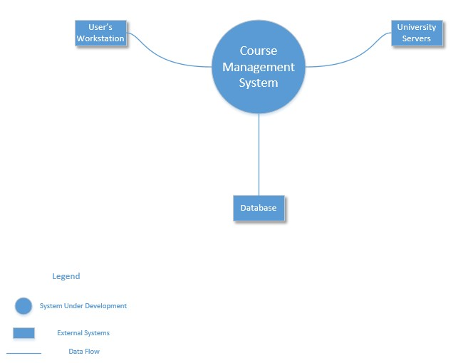

# 2.1 ADD Step 1: Review Inputs

| Category        | Details           |
| ------------- |:-------------|
| Design Purpose      | The purpose is to produce an efficient and sufficiently detailed design to support the construction of the Course Management System. |
| Primary Functional Requirements     | The primary use cases were determined to be:   UC-1: Because it directly supports the primary requirements of the system   UC-4: Because it directly supports the primary requirements of the system   UC-6: Because it directly supports the primary requirements of the system   UC-13: Because it directly supports the primary requirements of the system   UC-16: Because of the technical issues associated   UC-20: Because of the technical issues associated    |

### Quality Attribute Scenarios: The scenarios were described in Section 1.2. They have now been prioritized as follows:

| Scenario ID        | Importance to the Customer           | Difficulty of Implementation According to the Architect  |
| ------------- |:-------------:| :-----:|
| QA-1      | High | High |
| QA-2      | High      |   Low |
| QA-3 | High      |    Medium |
| QA-4 | Medium    | Medium |
| QA-5 | High | High|

### Constraints: All of the constraints discussed in Section 1.3 are included as drivers.

# 2.2 Iteration 1

### Selecting drivers
This is the first iteration of the ADD process on the CMS system. The iteration goal is to establish an overall system structure. The following influence that structure:

QA-1: Performance  
QA-2: Modifiability  
QA-3: Availability  
CON-2: Must be user friendly. Support Dutch and English. Max 3 clicks to reach any content. Single login to access all content. Consistent UI 
CON-3: All content must be accessible by disabled users  
CON-5: Must work and synchronize with secondary universities  

