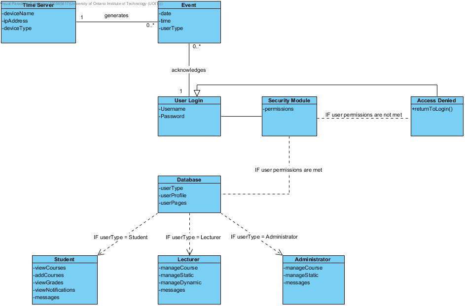
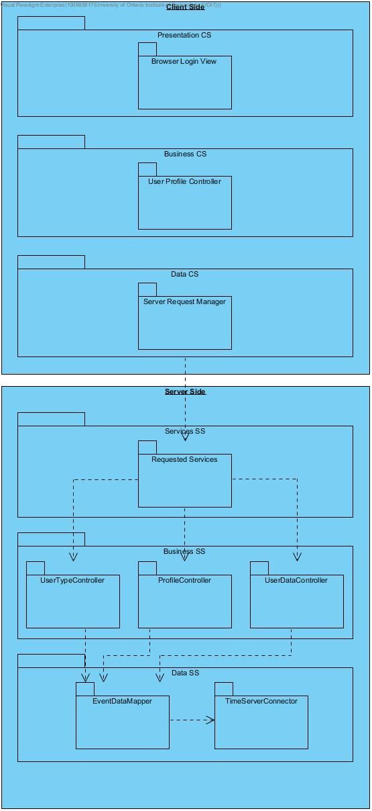
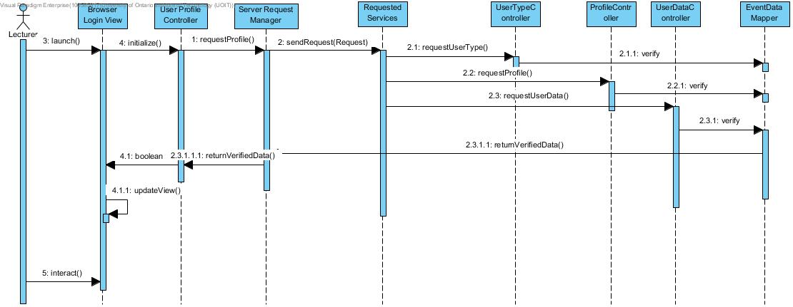

# 3.0 Iteration 1

**3.0.1 Selecting Drivers**  
The goal of this iteration is to address the general architectural concern of identifying structures to support primary functionality.

In this second iteration the architect considers the system’s primary use cases:

UC-1: Manage Courses  
UC-4: Manage Static Course Information  
UC-6: Manage Dynamic Course Information   
UC-13: Send Messages 
UC-21: Login  

**3.0.2 Elements of the System to Refine** 
The elements that will be refined in this iteration are the Web based application architecture,  the User Interface and the MySQL relational database. In order to fully support the functionality, there will be collaboration of all the layers within these architectures 

**3.0.3 Design Concepts that Satisfy the Selected Drivers**  
The following table summarizes the design decisions:

| Design Decisions and Location | Rationale and Assumptions |
| :---------------------------- | :------------------------ |
| Create a Domain Model for the application | Before starting a functional decomposition we must create an initial domain model for the system. We must identify major entities in the domain and their relationships.

No other alternatives were considered as this is the foundation. |
| Identify Domain Objects that map to functional requirements. | Each distinct functional element of the application needs to be encapsulated in a self-contained building block -- a domain object.

You could skip the consideration of domain objects but you risk requirement considerations. |
| Decompose Domain Objects into general and specialized components. | Domain objects represent complete sets of functionality. “Components” are referred to as modules.

There are no good alternatives. |
| Use Spring Framework and Hibernate | Spring is a widely used framework to support enterprise application and Hibernate integrates well with Spring. Other alternatives were considered in JEE and other ORM frameworks but due to FCAPS and the fact that there was no real push to select a specific one so Spring and Hibernate were chosen.|

**3.0.4 Instantiate Architectural Elements, Allocate Responsibilities, and define Interfaces**  

The following table contains the design decisions made:

| Design Decisions and Location | Rationale |
| :---------------------------- | :------------------------ |
| Create only an initial domain model | Primary use case entities need to be identified and modeled but only an initial domain model is created to accelerate this phase of the design |
| Map the system to use cases to domain objects | Initial identification of domain objects can be made with the system use cases.  |
| Decompose the domain objects across the layers to identify layer specific modules with an explicit interface | This technique ensures that modules support all functionalities. This does arise a architectural concern CRN-1: A majority of modules shall be unit tested. |
| Connect components associated with modules using Spring | This allows different aspects to be supported and modules to be unit tested (CRN-1).|
| Associate frameworks with a module in data layer | ORM mapping is encapsulated in the modules that are contained in the data layer.|

**3.0.5 Sketch Views and Record Design Decisions**  
As a result of the decisions made in step 5, several diagrams were created:

  
**FIGURE 3.1** Initial Domain model

  
**FIGURE 3.2** Domain Objects associated with the use cases

  
**FIGURE 3.3** Modules that support primary use cases

| Element | Responsibility |
| :------ | :------------- |
| Browser Login View | Displays the login view that asks user for username and password inputs. |
| User Profile Controller | Displays the user profile information after login is successful. |
| Server Request Manager | Responsible for communication with the server-side logic |
| Requested Services | Provides a facade that receives the requested services from the clients. |
| UserTypeController | Contains business logic that contains the user type information. |
| ProfileController | Contains business logic that contains user profile information. |
| UserDataController | Contains business logic that contains user data for the other web pages like manage course, etc. |
| EventDataMapper | Responsible for the persistence of operations related to the events requested. |
| TimeServerConnector | Responsible for the communication of the system with the time servers. |

Figure 3.4 shows an initial sequence diagram for UC-21 (user logs into system). It shows how a lecturer would start up and login to the system as well as the response from the system.

  
**FIGURE 3.4** Sequence Diagram for UC-21

From the interactions identified in the sequence diagram, initial methods for the interfaces of the interacting elements can be identified:

**Element:** User Profile Controller
bool initialize(): Opens the network representation of the user profile so the user can interact with it.
updateView(): The profile view is update after receiving verified data from the server.

**Element:** Server Request Manager
requestProfile(): All profile related information is requested to the server.

**Element:** Requested Services
sendRequest(Request): All the requested services needed are received by the server

**Element:** UserType, Profile and UserData Controller
requestUserType(), requestProfile(), requestData(): All of the necessary data is sent to the next element.

**Element:** EventDataMapper
Verify: All the requested data from the database is verified.
returnVerifiedData(): All verified data above is returned back to the client.

**3.0.6 Perform Analysis of Current Design and Review Iteration**  
The decisions made in this iteration provided an initial understanding of how functionality is supported in the system.

| Not Addressed | Partially Addressed | Completely Addressed | Design Decisions Made During the Iteration |
| :------------ | :------------------ | :------------------- | :----------------------------------------- |
|               |                     |UC-1                  |Modules across the layers and preliminary interfaces to support this use case have been identified.|
|               |                     |UC-4                  |Modules across the layers and preliminary interfaces to support this use case have been identified.|
|               |                     |UC-6                  |Modules across the layers and preliminary interfaces to support this use case have been identified.|
|               |UC-13                |                      |Modules across the layers and preliminary interfaces to support this use case have been identified.|
|               |                     |UC-16                 |Modules across the layers and preliminary interfaces to support this use case have been identified.|
|               |                     |UC-20                 |Modules across the layers and preliminary interfaces to support this use case have been identified.|
|               |                     |UC-21                 |Modules across the layers and preliminary interfaces to support this use case have been identified.|
|               |QA-1                 |                      |The elements that support the associated use case (UC-17) have been identified.|
|               |                     |QA-2                  |The elements that support the associated use case(UC-1) have been identified.|
|               |QA-3                 |                      |The elements that support the associated use case(UC-16) have been identified.|
|               |                     |CON-2                 |User interface modules have been identified.|
|               |CON-3                |                      |User interface modules have been identified.|
|               |                     |CON-5                 |No relevant decisions were made.|
|               |CRN-1                |                      |New architectural concern was introduced in this iteration. It was also partially handled by Connect components associated with modules using Spring.|
