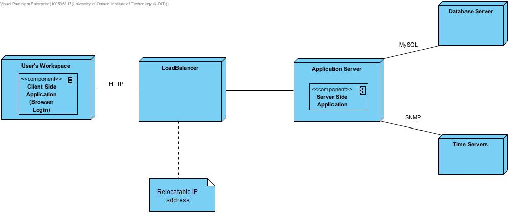

# 4.0 Iteration 3: Addressing Quality Attribute Scenario
This section presents the results of the activities that are performed in each of the steps of ADD in the third iteration of the design process.

**4.0.1 Selecting Drivers**  
For this iteration, the architect focuses on QA-3 quality attribute scenario: Availability- The system should always be up for all users, restricting access depending on user type. If the system goes down it should come back up in a few hours. 4 hours/month downtime allowed.

**4.0.2 Elements of the System to Refine** 
For this scenario, the elements that will be refined are the physical nodes that were identified during the first iteration.
-Application Server
-Database Server

**4.0.3 Design Concepts that Satisfy the Selected Drivers** 
The design concepts used in this iteration are the following:

| Design Decisions and Location | Rationale |
| :---------------------------- | :-------- |
| Introduce the active redundancy tactic by replicating the application server and other critical components such as the database | By replicating elements if there is any down time the back ups can be used to then a comparison between databases can be done to ensure changes during down time are not lost |

**4.0.4 Instantiate Architectural Elements, Allocate Responsibilities, and define Interfaces** 
The instantiation design decisions are summarized in the following table:

| Design Decisions and Location | Rationale |
| :---------------------------- | :-------- |
| Use active redundancy and load balancing in the application server | Because two replicas of the application server are active at any time, it makes sense to distribute and balance the load among the replicas. This tactic can be achieved through the use of the Load-Balanced Cluster pattern. This introduces a new architectural concern CRN-2:Manage state in replicas.|
| Implement load balancing and redundancy using technology support | Many technological options for load balancing and redundancy can be implemented without having to develop an ad hoc solution that would be less mature and harder to support. |

**4.0.5 Sketch Views and Record Design Decisions** 

The following table describes responsibilities for elements that have not been previously listed:

  
**FIGURE 4.2** Refined Deployment Diagram

| Element | Responsibility |
| :------ | :------------- |
| LoadBalancer | Dispatches requests coming from clients to the application servers. The load balancer also presents a unique IP address to the clients. |

The UML sequence diagram shown in Figure 4.2 illustrates how the LoadBalancer that was introduced in this iteration dispatches requests to support QA-3.
As the purpose of this diagram is just as an illustration, the names of the methods are just temporary.

  
**FIGURE 4.2** Sequence Diagram with LoadBalancer

**4.0.6 Perform Analysis of Current Design and Review Iteration**  
In this iteration important design decisions were made to address QA-3. The following table summarizes the status of the different drivers and the decisions made. Drivers that were completely addressed were removed.

| Not Addressed | Partially Addressed | Completely Addressed | Design Decisions Made During the Iteration |
| :------------ | :------------------ | :------------------- | :----------------------------------------- |
|               |UC-13                |                      |No relevant decisions were made. |
|               |QA-1                 |                      |No relevant decisions were made. |
|               |                     |QA-3                  |With redundancy we significantly  limit down time and  reduce probability of failure.|
|               |CON-3                |                      |No relevant decisions were made.|
|               |CRN-1                |                      |No relevant decisions were made.|
|CRN-2          |                     |                      |This is new and was introduced this iteration. At this point no relevant decisions were made.|
